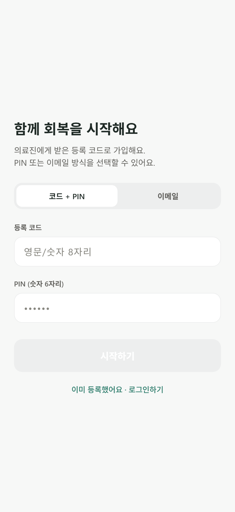
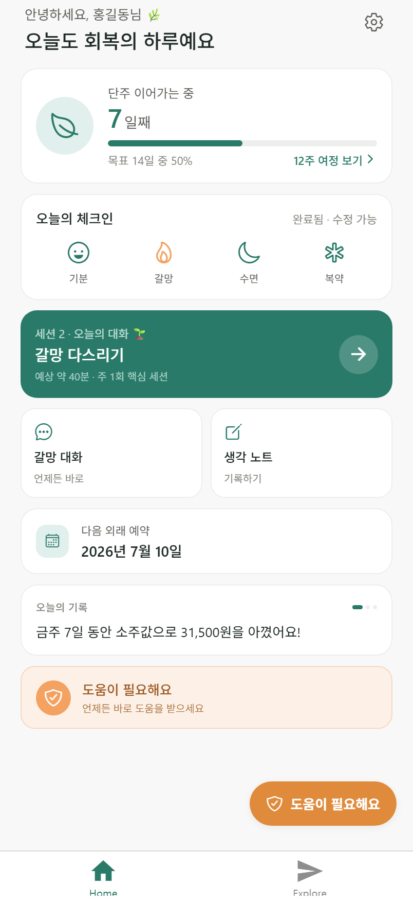
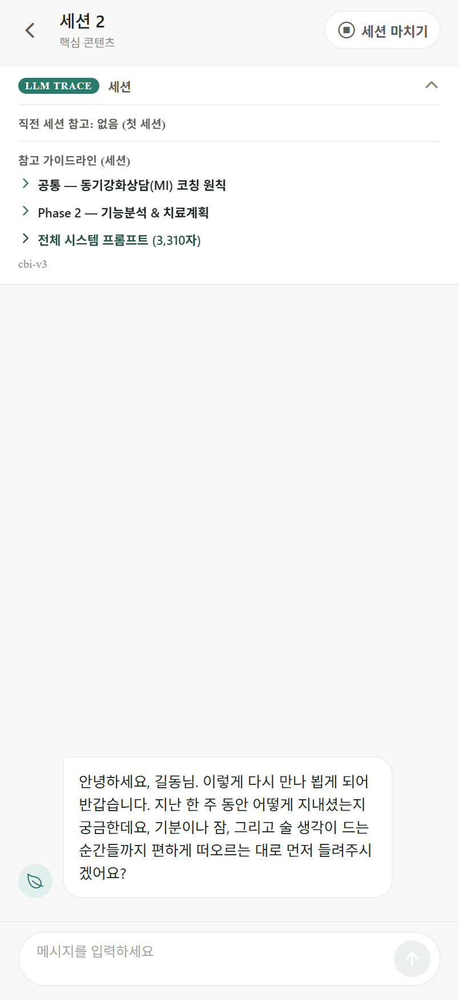
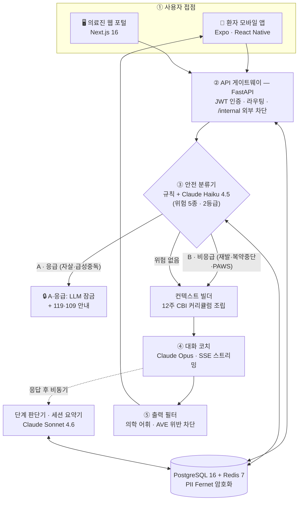

<div align="center">

<h1>알코올컷! · AUD-CBT</h1>

<b>An LLM-orchestrated CBT digital therapeutic for alcohol use disorder.</b>

<sub>알코올 사용장애(AUD) 환자를 위한 LLM 기반 인지행동치료(CBT) 어플리케이션 —<br/>
사용자는 모바일 앱에서 12주 CBT 코치와 대화하고, 의료진은 웹 포털에서 회복 경과·위기 신호를 모니터링한다.</sub>

<b>환자 앱:<a>https://aud-cbt-patient.vercel.app/<a></b>
<b>의료진 웹:[https://aud-cbt-patient.vercel.app](https://aud-cbt.vercel.app/patients)</b>

<br/><br/>


<br/><br/>





</div>

---

## Highlights

> **AUD-CBT는, 퇴원한 알코올 사용장애 환자가 다음 외래까지의 공백기를 안전하게 건너도록 돕는 디지털 치료제입니다.**

- **12주 CBT 코치 (대화 LLM)** — Claude Opus가 동기강화상담(MI) 스타일로 매주 세션을 진행. 한 세션은 5단계(체크인 → 과제리뷰 → 핵심콘텐츠 → 개인화 → 다음과제)로, 코치와 단계 판단기가 같은 정의를 공유해 일관되게 흐릅니다.
- **실시간 위기 분류 · 차단** — 모든 발화를 *규칙 + Claude Haiku* 하이브리드로 분류. 자살·급성중독 신호는 **즉시 LLM 잠금 + 긴급 연락 안내**, 재발·복약중단은 전문 분기 응답. *재현율 우선* 설계.
- **의료진 모니터링 포털** — 기분·갈망·수면 추이, 안전 이벤트 타임라인, 복약 순응률, 세션 이력을 한 화면에. 위기 시 LLM 잠금/해제까지.

---

## Background — 배경

대상은 **DSM-5 기준 중등도~중증 AUD**로 입원 치료 후 퇴원한 환자입니다. 이 시기 90일 재발률은 **40~60%**, 자살 위험은 일반 인구의 약 **10배**에 달합니다. 정작 환자가 가장 취약한 이 "공백기"에는 임상적 개입이 거의 닿지 않습니다.

AUD-CBT는 **Project MATCH CBT Manual(Kadden et al., 1995)** 과 **NIAAA Combined Behavioral Intervention(COMBINE, 2004)** 매뉴얼을 근거로 한 **12주 · 4-Phase 구조화 CBT**를 모바일로 전달하고, 그 대화를 의료진이 원격으로 지켜보게 합니다. (→ [References](#references--임상-근거))

---

## The Repository — 저장소 구성

세 개의 사용자 접점 + 이를 잇는 백엔드로 구성된 **모노레포**입니다.

| 구성요소 | 스택 | 역할 |
|---|---|---|
| 📱 [`patient-app/`](patient-app/cbt-app) | Expo · React Native | **환자 모바일 앱** — CBT 세션, 일일 체크인, 갈망 대화, 안전망 |
| 🖥️ [`provider-web/`](provider-web) | Next.js 16 · shadcn/ui | **의료진 웹 포털** — 환자 목록·상세 대시보드, 신규 등록(D0), 재평가(D4) |
| ⚙️ [`backend/`](backend) | FastAPI · PostgreSQL 16 · Anthropic SDK | **API 게이트웨이 + LLM 오케스트레이션 + 안전 분류** |
| 📄 [`docs/`](docs) | `openapi.yaml`(단일 정본) | API 명세 · 아키텍처 다이어그램 · 안전분류 검증 자산 |

---

## Architecture — 아키텍처

환자 발화 한 턴이 흐르는 **실제 런타임 파이프라인**입니다.



**처리 순서** (`conversation_service.stream_user_message`): 발화 저장 → **안전 분류**(등급 A면 즉시 잠금·중단) → **컨텍스트 빌드** → **코치 LLM 토큰 스트리밍(SSE)** → **출력 필터** → 응답 저장 → **단계 추적**(비동기). 세션 종료는 환자가 직접 누를 때만이며, 이때 **세션 요약기**가 다음 주차로 임상 맥락을 인계합니다.

> 외부로 나가는 모든 LLM 호출은 게이트웨이에서 **비식별화**(주민번호·전화·이메일·카드/계좌 등 정형 식별자 마스킹)를 거칩니다. 단, 안전 분류 정확도를 위해 임상적 자연어 신호는 일부러 보존합니다.
> 상세 5-레이어 설계도 → [`docs/aud_cbt_v3_system_architecture.svg`](docs/aud_cbt_v3_system_architecture.svg)

---

## Safety Classifier — 안전 분류기 검증

단발 문장이 아니라 **직전 2~3턴 맥락**을 함께 보는 다중 턴 분류기입니다. 같은 핵심 표현 *"죽고싶네"* 도, 맥락에 따라 **관용어(일반)** 와 **진짜 위기(등급 A)** 로 정반대로 구분합니다. 임상 원칙은 **재현율 > 정밀도**를 따릅니다.

| 검증 항목 | 결과 |
|---|---|
| 다중 턴 시나리오 (실 백엔드 분류기) | **9턴 중 8턴 통과 = 88.9%** |
| 등급 A(자살·급성중독) 오음성(false-negative) | **0%** |
| 단발 스모크 | **8건 전부 통과 = 100%** (룰 키워드 레이어 백스톱 작동까지 확인) |
| 분류 기준 | NIAAA CBI 매뉴얼에 **1:1 매핑된 518개 항목 카탈로그**에서 도출 (검수 완료) |

> 두 테스트를 합쳐 **유일한 실패 1건(멀티턴 MT-B01)도 안전 방향의 과분류(위양성)일 뿐, 실제 위험을 놓친 위음성은 0건**입니다(재현율 우선 원칙에 부합). 각 턴은 **5회 반복해 5/5 전부 통과해야 PASS**로 채점합니다. 검증 시나리오·스크립트·결과 → [`docs/`](docs)

---

## Privacy & Compliance — 개인정보보호

환자의 **식별정보와 건강정보(민감정보)** 를 다루는 서비스인 만큼, 「개인정보 보호법」과 「개인정보의 안전성 확보조치 기준」(개인정보보호위원회고시 제2025-9호)을 **설계 단계부터** 반영했습니다. 임상 안전(위기 분류)과 데이터 안전(암호화·접근통제)을 같은 우선순위로 다룹니다.

### 기술적 안전조치

| 영역 | 구현 | 근거 법령 |
|---|---|---|
| **저장 암호화** | 환자 **이름·전화·이메일**과 **위기 발화 원문**을 Fernet 인증암호(AES-128-CBC + HMAC-SHA256)로 암호화 저장. `EncryptedString` ORM 타입으로 전 코드에 투명 적용 | 안전조치 기준 제7조 · 법 제23조 |
| **비식별화 (국외 이전)** | 외부 LLM(미국) 호출 전 **단일 게이트웨이**에서 주민번호·전화·이메일·카드/계좌 등 정형 식별자를 자동 마스킹. 우회 경로·해제 플래그 없음 | 법 제28조의8 · 제24조의2 |
| **접근통제 (RBAC)** | JWT 역할 분리 + `provider_id` 일치 검증으로 **담당 환자만** 열람(IDOR 차단), 전역 우회 권한 없음 | 제5조 · 제6조 |
| **접속기록** | 환자 상세 열람·LLM 안전잠금 해제 등 민감 행위를 **계정·시각·대상·행위** 단위로 append-only 기록 | 제8조 |
| **인증** | 비밀번호·PIN **bcrypt 단방향 해시**, HS256 JWT(역할별 만료), CSPRNG 1회용 등록코드, 로그인 레이트리밋·계정 열거 차단 | 제5조·제6조·제7조 |
| **전송보안** | BFF 프록시로 백엔드 토큰 은닉, `httpOnly`·`SameSite` 세션 쿠키, CORS 출처 화이트리스트, 보안 헤더(HSTS·nosniff·X-Frame-Options) | 제6조·제7조 |
| **운영 안전장치** | 운영 환경에서 암호화 키·시크릿 미설정 시 **기동 거부**(fail-fast), 회원 삭제 시 관련 레코드 비가역 파기 | 제7조 · 제21조 |

### 동의 구조 (환자 앱 가입 화면)

개인정보 보호법은 ①일반·②민감·④국외이전 동의를 **각각 구분된 체크박스**로 받도록 요구합니다(제22조 제1항 제5호). 가입 동의 화면([`ConsentSheet.tsx`](patient-app/cbt-app/components/ConsentSheet.tsx))은 이를 그대로 구현합니다.

| 동의 항목 | 성격 | 근거 |
|---|---|---|
| ① 개인정보 수집·이용 | 필수 | 제15조 |
| ② 민감정보(건강정보) — 별도 동의 | 필수 | 제23조 |
| ③ 담당 의료진 제공 | 필수 | 제17조 |
| ④ 민감정보 국외 이전(Anthropic, PBC / 미국) | 필수·별도 | 제28조의8 |
| ⑤ 위기 시 안전 조치 | 고지(동의 불요) | 제18조 제2항 제3호 |

> 만 19세 이상 이용, 열람·정정·삭제·처리정지·동의 철회 등 정보주체 권리를 보장하도록 설계했습니다. 개인정보 처리방침 전문 → [`docs/개인정.md`](docs/개인정.md)

> [!NOTE]
> **프로토타입 범위** — 본 앱은 해커톤 출품작으로 인허가 의료기기가 아니며, 위 조치는 핵심 식별·민감정보를 중심으로 적용됩니다. TLS 등 전송 구간 암호화는 배포 인프라(리버스 프록시)가 담당하고, 동의 이력의 서버 저장은 정식 출시 시 연동됩니다.

---

## Quick Start — 빠른 시작(로컬 구동 시)

> 전제: Docker Desktop, Node.js 20+. **키 없이도 `USE_LLM_MOCK=true`로 전 흐름이 결정적 목으로 동작**합니다.

### ① 백엔드 (필수)

```bash
cd backend
cp .env.example .env
docker compose up --build -d                          # Postgres 16 + Redis 7 + FastAPI
docker compose exec api python -m scripts.seed_demo   # 데모 계정·환자 생성(코드 출력)
# → API     http://localhost:8000/v1
# → Swagger http://localhost:8000/docs
# → Health  http://localhost:8000/v1/internal/health
```

> 실제 Claude 응답을 보려면 `.env`에 `ANTHROPIC_API_KEY=sk-ant-...` 와 `USE_LLM_MOCK=false`.

### ② 의료진 웹 · ③ 환자 앱

```bash
cd provider-web && npm install && npm run dev          # http://localhost:3000 (백엔드 실연동)
cd patient-app/cbt-app && npm install && npx expo start # Expo Go(QR) · 'a' Android · 'i' iOS · 'w' Web
```

---

## Demo — 데모

아래는 환자 메시지 한 건이 백엔드 파이프라인(안전분류 → 컨텍스트 → Opus 4.7 코치 → 출력필터)을 통과한 **실제 한 턴**입니다.

> **환자 입력**
> 요즘 회식 자리에서 술 권유를 받으면 거절하기가 너무 힘들어요. 이번 주에도 한 번 무너질 뻔했어요.
>
> **코치 응답** (`claude-opus-4-7`, SSE 스트리밍)
> 안녕하세요 길동님. 먼저 이렇게 솔직하게 이야기 꺼내주셔서 고맙습니다. (…) 그래서 우선 지난 한 주를 좀 가볍게 점검해보고 싶은데요 — **기분**, **갈망**, **잠**은 어떠셨어요? 그리고 실제로 **술을 드신 적**이 있었는지도 편하게 말씀해 주세요.

같은 턴에서 **안전 분류기는 `grade: none`(오탐 없이 정상 진행)**, **단계 추적기는 5단계 중 1단계(체크인 리뷰)** 를 독립적으로 확인했습니다.

### Demo Accounts — 데모 계정

`docker compose exec api python -m scripts.seed_demo` 실행 후:

| 역할 | 접속 | 자격 증명 |
|---|---|---|
| **의료진** (웹 `:3000`) | 이메일 + 비밀번호 | `demo.doctor@example.com` / `DemoPassword!2026` |
| **환자** (앱) | 등록 코드 + PIN | 등록 코드 = **시드 실행 시 출력**(예: `MBVVP56U`) · PIN = `482917` |

> 시드 환자는 *홍길동*(중증 AUD, 퇴원 7일차, naltrexone 복용, 2주차 진행 중)으로 생성되어 대시보드에 바로 데이터가 보입니다.

---

## Tech Stack — 기술 스택

| 영역 | 스택 |
|---|---|
| **백엔드** | Python 3.11+ · FastAPI · SQLAlchemy 2.0 · Alembic · PostgreSQL 16 · Redis 7 · Pydantic v2 · PyJWT + passlib · cryptography(Fernet) PII 암호화 · sse-starlette · pytest |
| **환자 앱** | TypeScript · Expo SDK 54 / React Native 0.81 / React 19 · expo-router 6 · Zustand · TanStack Query · react-hook-form + zod · expo-secure-store |
| **의료진 웹** | TypeScript · Next.js 16 (App Router) / React 19 · shadcn/ui + Tailwind v4 · TanStack Query + Table · Recharts · jose · openapi-fetch · BFF 프록시(백엔드 토큰 은닉) |
| **LLM** | Anthropic Claude SDK — 코치 `claude-opus-4-7` · 단계판단/요약 `claude-sonnet-4-6` · 분류/필터/분석 `claude-haiku-4-5` *(모두 환경변수로 교체 가능)* |
| **공통** | Docker Compose · `openapi.yaml` 단일 정본(Swagger ↔ TS 타입 생성) · ruff/black · ESLint/Prettier |

> **모델 분담 근거** — 환자에게 보이는 유일한 텍스트인 코치 대화엔 최고 품질 **Opus**, 판단·요약엔 중간 추론 **Sonnet**, 호출량 많은 분류/추출엔 빠르고 저렴한 **Haiku**.

---

## References — 임상 근거

- Kadden, R., et al. (1995). *Cognitive-Behavioral Coping Skills Therapy Manual.* Project MATCH Monograph Series, Vol. 3. NIAAA.
- NIAAA (2004). *Combined Behavioral Intervention (CBI) Manual.* COMBINE Monograph Series.
- American Psychiatric Association (2013). *Diagnostic and Statistical Manual of Mental Disorders (DSM-5).*

---

## Disclaimer & License

> [!IMPORTANT]
> **본 프로젝트는 연구·교육·대회 심사를 위한 프로토타입이며, 인허가를 받은 의료기기가 아닙니다.**
> 실제 진단·치료·응급 대응에 사용할 수 없습니다. 표시되는 긴급 연락처(119·109 등)는 정보 제공용이며, 위기 상황에서는 즉시 공식 응급 서비스에 연락하십시오. 모든 환자 데이터는 데모용 시드이며, 환자 식별정보(이름·연락처 등)는 저장 시 Fernet으로 암호화됩니다.

**© 2026 KNU Pentastic — All rights reserved.** 본 저장소는 대회 출품용이며 공개 오픈소스로 배포되지 않습니다. 권리자의 사전 서면 허락 없이 사용·복제·수정·배포를 금합니다. 전문은 [`LICENSE`](LICENSE).

> 대회 규칙에 따라 수상 시 스폰서에게 부여되는 *비독점·기간 한정* 라이선스는 이와 별개이며, 본 저장소를 일반 공중에 공개 라이선스하는 것이 아닙니다. 소유권은 팀이 계속 보유합니다.

<sub>본 README의 모든 스크린샷·대화·로그는 2026-06 기준 로컬에서 실제 실행(실 Claude Opus 4.7 호출 포함)해 캡처했습니다. · AUD-CBT v3.0 · KNU Pentastic</sub>
