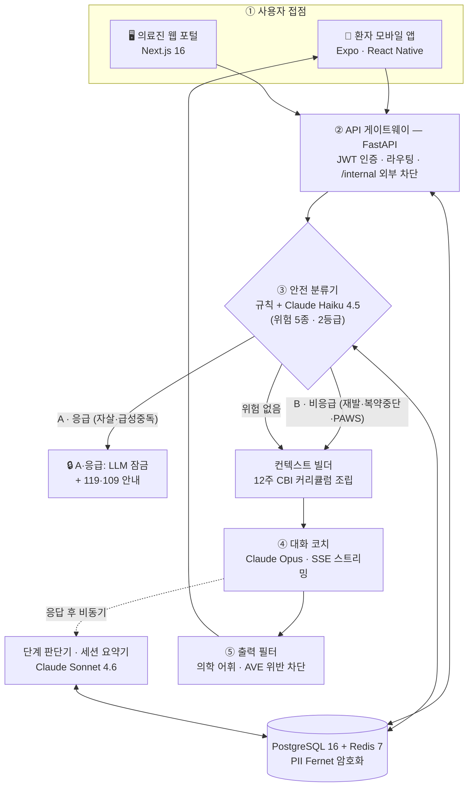
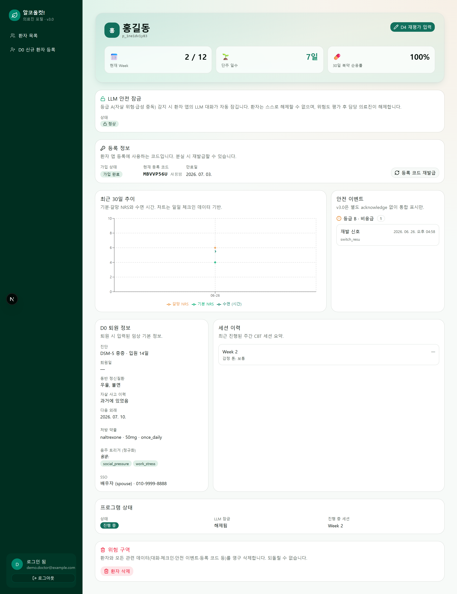

<div align="center">

<h1>알코올컷! · AUD-CBT</h1>

<b>An LLM-orchestrated CBT digital therapeutic for alcohol use disorder.</b>

<sub>알코올 사용장애(AUD) 환자를 위한 LLM 기반 인지행동치료(CBT) 어플리케이션 —<br/>
환자는 모바일 앱에서 12주 CBT 코치와 대화하고, 의료진은 웹 포털에서 회복 경과·위기 신호를 모니터링합니다.</sub>

<br/><br/>

<b>🏆 강원대학교 2026년 X+AI·SW 융합 프로젝트 — 우수상 수상작</b>
&nbsp;·&nbsp;
<a href="https://www.youtube.com/watch?v=1iPfsawb0L0"><b>🎬 시연 영상</b></a>

<br/><br/>


<br/>


<br/><br/>


</div>

---

## 개요 — Overview

**알코올컷!(AUD-CBT)** 은 강원대학교 **2026년 X+AI·SW 융합 프로젝트** **우수상** 수상작으로, 퇴원한 알코올 사용장애 환자가 다음 외래까지의 공백기를 안전하게 건너도록 돕는 디지털 치료제 프로토타입입니다. 범용 챗봇이 아니라, **검증된 표준 치료 매뉴얼(NIAAA CBST·CBI)의 구조를 그대로 디지털로 옮긴 서비스**입니다.

- **12주 CBT 코치 (대화 LLM)** — Claude Opus가 동기강화상담(MI) 스타일로 매주 세션을 진행. 한 세션은 5단계(체크인 → 과제리뷰 → 핵심콘텐츠 → 개인화 → 다음과제)로, 코치와 단계 판단기가 같은 정의를 공유해 일관되게 흐릅니다.
- **실시간 위기 분류 · 차단** — 모든 발화를 *규칙 + Claude Haiku* 하이브리드로 분류. 자살·급성중독 신호는 **즉시 LLM 잠금 + 긴급 연락 안내**, 재발·복약중단은 전문 분기 응답. *재현율 우선* 설계 — 실 배포 코드 검증에서 **응급 위음성 0건**.
- **의료진 모니터링 포털** — 기분·갈망·수면 추이, 안전 이벤트 타임라인, 복약 순응률, 세션 이력을 한 화면에. 위기 시 LLM 잠금/해제까지.

세 개의 사용자 접점 + 이를 잇는 백엔드로 구성된 **모노레포**입니다.

| 구성요소 | 스택 | 역할 |
|---|---|---|
| 📱 [`patient-app/`](patient-app/cbt-app) | Expo · React Native | **환자 모바일 앱** — CBT 세션, 일일 체크인, 갈망 대화, 안전망 |
| 🖥️ [`provider-web/`](provider-web) | Next.js 16 · shadcn/ui | **의료진 웹 포털** — 환자 목록·상세 대시보드, 신규 등록(D0), 재평가(D4) |
| ⚙️ [`backend/`](backend) | FastAPI · PostgreSQL 16 · Anthropic SDK | **API 게이트웨이 + LLM 오케스트레이션 + 안전 분류** |
| 📄 [`docs/`](docs) | `openapi.yaml`(단일 정본) | API 명세 · 아키텍처 다이어그램 · 안전분류 검증 자산 |

---

## 배경과 문제 정의 — Background & Research

### 대회 배경

강원대학교 **2026년 X+AI·SW 융합 프로젝트**는 자신의 전공·도메인(X)에 AI·SW를 융합해 실제 문제를 해결하는 대회입니다. 우리 팀은 **X = 정신건강 의료(알코올 사용장애 회복)** 를 선택해, 근거 기반 심리치료 매뉴얼을 LLM 오케스트레이션으로 전달하는 시스템을 설계·구현했고 **우수상**을 수상했습니다.

### 문제 정의

대상은 **DSM-5 기준 중등도~중증 AUD**로 입원 치료 후 퇴원한 환자입니다.

- 중독 치료 후 재발의 **약 3분의 2가 첫 90일 안에** 일어나고 (Hunt et al., 1971), 치료받은 환자의 **40~60%가 1년 안에** 재사용으로 돌아갑니다 (McLellan et al., 2000).
- AUD 환자의 자살 위험은 일반 인구의 **약 10배**로 보고됩니다 (Wilcox et al., 2004).
- 그런데 퇴원 후 임상 접점은 통상 **월 1~2회 외래**가 전부입니다. '지속 외래'(퇴원 후 월 1회 이상)를 1년간 유지하는 환자는 **12.7%**, 1년 이상 단주 유지율은 **14.5%** 수준입니다.†
- 위험은 매일 존재하는데 개입은 한 달에 한두 번 — 가장 취약한 시기에 **"매일의 공백"** 이 생깁니다. 알코올컷!은 이 공백을 메우는 것을 목표로 합니다.

<sub>† 지속 외래 유지율·단주 유지율은 대회 발표자료의 팀 리서치 수치입니다. 문헌 인용이 병기된 수치는 국제 통계입니다.</sub>

### 연구 근거

**치료 기전 — ABC 인지 모델.** CBT는 음주를 **학습된 행동**으로 봅니다: 환경 단서가 갈망을 '조건화'해 자동으로 음주를 촉발하므로, 상황(A)과 음주(C) 사이에 끼어 있는 **자동 사고(B)** 가 개입 지점입니다.

| | A · 상황 | B · 생각 | C · 행동 |
|---|---|---|---|
| 개입 전 | "퇴근 후, 힘든 하루" | *"한 잔쯤은 괜찮아"* (자동 사고) | 음주 |
| **CBT 개입 후** | 동일 | *"산책으로 푼다"* (대안적 사고) | **단주 유지** |

목표는 내가 어떤 고위험 상황에서 마시는지 찾아내고, 그 상황을 음주 없이 다루는 구체적 기술을 익히는 것입니다. 효과는 반복 검증되어 있습니다 — 53개 무작위대조시험(RCT) 메타분석 (Magill & Ray, 2009), 대규모 다기관 RCT인 Project MATCH (Project MATCH Research Group, 1997).

**임상 토대 — 두 개의 NIAAA 매뉴얼의 결합.** **CBST**(인지행동 대처기술치료, Kadden et al., 1995 · Project MATCH)는 CBT를 알코올 사용장애용으로 매뉴얼화한 표준 프로토콜이고, **CBI**(복합행동중재, NIAAA COMBINE, 2004)는 CBT 기술훈련에 동기강화·가족참여·약물지원을 통합한 확장 매뉴얼입니다. 본 프로젝트는 **CBST를 핵심 치료 토대로 삼고, CBST에 없는 재발·복약 대응 절차를 CBI에서 가져와 결합**했으며, 대화 스타일은 동기강화상담(MI)을 따릅니다.

**12주 · 4-Phase 커리큘럼** — 주 1회 구조화 세션으로 진행합니다.

| Phase | 주차 | 핵심 질문 | 내용 |
|---|---|---|---|
| **01 동기** | 1주 | 왜 끊는가 | 단주 동기 재확인 · 라포 형성 |
| **02 분석** | 2~3주 | 무엇이 나를 마시게 하는가 | 음주 패턴 · 고위험 상황 분석 |
| **03 기술 훈련** | 4~11주 | 어떻게 막을 것인가 | 거절 · 갈망 · 대처 기술 |
| **04 종결** | 12주 | 어떻게 유지하는가 | 유지 · 재발방지 계획 |

**세션 구조 — 전통 CBT 회기의 1:1 이식.** 한 세션의 5단계는 Project MATCH의 회기 구조를 그대로 옮긴 것입니다. 코치와 단계 판단기가 이 정의를 공유합니다.

| 전통 CBT 회기 (Project MATCH) | 본 앱의 5단계 세션 |
|---|---|
| 도입 · 한 주 점검 | ① 체크인 리뷰 |
| 지난 회기 기술·과제 검토 | ② 지난 주 과제 리뷰 |
| 새 기술의 근거·지침 제시 | ③ 핵심 콘텐츠 전달 |
| 치료사 시연 → 역할극 | ④ 개인화 적용 — 실제 상황을 ABC로 |
| 다음 회기 과제 부여 | ⑤ 이번 주 과제 |

**왜 LLM인가.** 매뉴얼 기반 치료는 세션 구조·콘텐츠가 명시적이어서 **LLM 오케스트레이션에 적합**합니다: 주차별 커리큘럼을 컨텍스트로 조립해 코치에게 주입하고, 별도 모델이 단계 준수를 독립적으로 추적하며, 안전 분류 기준은 CBI 매뉴얼에 **1:1 매핑된 518개 항목 카탈로그**로 도출하고 출처 매핑을 검수했습니다. 그리고 LLM은 외래가 닿지 못하는 시간을 메웁니다 — **주 1회 구조화 세션**에 더해, 갈망·위기의 순간 **24시간 즉시 응답하는 갈망 대응 모드**가 함께 동작합니다. 스마트폰 기반 사후관리가 실제로 위험 음주를 줄인다는 것은 **A-CHESS 무작위 임상시험 (Gustafson et al., 2014)** 으로 입증된 접근입니다. (→ [References](#references--임상-근거))

---

## 핵심 기능 — Core Features

### ⓪ 환자 모바일 앱 — Patient App

파이프라인의 모든 턴이 시작되고 끝나는 곳입니다. 퇴원 환자가 12주 동안 매일 손에 쥐는 유일한 접점으로, **Expo · React Native** 단일 코드베이스로 구현했습니다.

- **12주 CBT 세션 채팅** — 코치(Claude Opus)의 응답을 **SSE 토큰 스트리밍으로 실시간 렌더링**합니다. 완성된 응답을 기다리지 않고 타이핑되듯 표시되어, 갈망·위기의 순간에도 "지금 응답이 오고 있다"는 즉각적 피드백을 줍니다. 세션 종료는 환자가 직접 선택할 때만 이뤄지며, 이때 백엔드 세션 요약기가 다음 주차로 맥락을 인계합니다.
- **일일 체크인** — 기분·갈망·수면·음주 여부를 매일 기록합니다. 이 데이터는 코치의 세션 1단계(체크인 리뷰)와 의료진 대시보드의 30일 추이 그래프, 두 곳의 원천이 됩니다.
- **갈망 대응 모드** — 주 1회 구조화 세션과 별개로, 갈망이 오는 순간 24시간 진입할 수 있는 즉시 대화 채널입니다.
- **위기 시 잠금 UI** — 안전 분류기가 등급 A(자살·급성중독)를 판정하면 앱의 LLM 대화가 잠기고 **119·109 긴급 연락 안내 화면**으로 전환됩니다. 잠금 해제 권한은 의료진 포털에만 있으므로, 앱은 해제 전까지 안내 상태를 유지합니다 — 위기 순간에 챗봇이 아닌 사람에게 연결하는 것이 설계 원칙입니다.
- **등록 코드 + PIN 인증** — 이메일·비밀번호 대신 의료진이 발급한 등록 코드와 PIN으로 온보딩합니다. 인증 토큰은 `expo-secure-store`(iOS Keychain / Android Keystore)에 저장해 평문 노출을 차단합니다.

**상태 관리 분리** — 서버 상태(세션·체크인·환자 정보)는 TanStack Query로 캐싱·동기화하고, 화면 단위 클라이언트 상태는 Zustand로 분리했습니다. 폼 입력은 react-hook-form + zod 스키마로 검증합니다.

### ① LLM 오케스트레이션 — 멀티모델 파이프라인

환자 발화 한 턴이 흐르는 **실제 런타임 파이프라인**입니다. 하나의 거대 프롬프트가 아니라, 역할별로 분리된 LLM 컴포넌트들이 협업합니다.



**처리 순서** (`conversation_service.stream_user_message`): 발화 저장 → **안전 분류**(등급 A면 즉시 잠금·중단) → **컨텍스트 빌드** → **코치 LLM 토큰 스트리밍(SSE)** → **출력 필터** → 응답 저장 → **단계 추적**(비동기). 세션 종료는 환자가 직접 누를 때만이며, 이때 **세션 요약기**가 다음 주차로 임상 맥락을 인계합니다.

- **모델 분담** — 환자에게 보이는 유일한 텍스트인 코치 대화엔 최고 품질 **Opus**, 단계 판단·세션 요약엔 중간 추론 **Sonnet**, 호출량 많은 분류·필터·발화 분석엔 빠르고 저렴한 **Haiku**. 모두 환경변수로 교체 가능합니다.
- **투명성(LLM Trace)** — 데모·검증 모드에서 각 응답이 어떤 가이드라인 블록과 시스템 프롬프트로 생성됐는지, 단계 판정·안전 등급·갈망 강도까지 턴 단위로 공개합니다.
- **결정적 목(mock)** — `USE_LLM_MOCK=true`면 API 키 없이 전체 파이프라인이 결정적으로 동작해, 검증·시연·CI가 재현 가능합니다.

> 상세 5-레이어 설계도 → [`docs/aud_cbt_v3_system_architecture.svg`](docs/aud_cbt_v3_system_architecture.svg)

### ② 실시간 안전 분류 · 차단

단발 문장이 아니라 **직전 2~3턴 맥락**을 함께 보는 **규칙 + LLM 하이브리드** 다중 턴 분류기입니다 — 같은 표현도 맥락에 따라 정반대로 판정합니다(아래 ③ 검증의 대비쌍 시나리오). 임상 원칙은 **재현율 > 정밀도**를 따릅니다.

- **등급 A (자살·급성중독)** → 즉시 LLM 잠금 + 119·109 긴급 연락 안내. 의료진 포털에 안전 이벤트 기록, 잠금 해제는 의료진이 수행.
- **등급 B (재발·복약중단·PAWS)** → 신호별 전문 분기 응답(예: 재발 시 절제위반효과(AVE) 인지왜곡 차단 대화).
- **룰 키워드 레이어** — LLM 판정과 독립적으로 동작하는 fail-safe 백스톱. LLM 하나에 안전을 맡기지 않습니다.

### ③ 안전 분류기 검증 — Verification

똑같은 *"죽고싶네"* 한마디도 맥락에 따라 **농담(일반)** 인지 **진짜 위기(등급 A)** 인지 정반대로 가려내는지 — 시연용 수치가 아니라 **실제 배포 코드의 `classify()`를 직접 호출**해 확인했습니다.

**검증 방법** — 멀티턴 시나리오 9턴 + 단발 스모크 8건, **총 17턴**을 실제 백엔드 분류기로 채점했습니다(턴마다 5회 반복, 5/5 통과해야 PASS). 정답과 분류기 판정을 맞춰 본 혼동 행렬입니다.

| 실제 정답 ＼ 분류기 판정 | 등급 A | 등급 B | PAWS | 일반 |
|---|:---:|:---:|:---:|:---:|
| **등급 A**·응급 (자살·급성중독) | **6** ✅ | · | · | · |
| **등급 B**·비응급 (재발·복약중단) | · | **4** ✅ | · | · |
| **PAWS** (금단 후유증) | · | · | **2** ✅ | · |
| **일반** (위험 없음) | · | ⚠️ **1** | · | **4** ✅ |

**한눈에 보기** — 대각선(✅)에 모일수록 정확합니다(· = 0건). **17턴 중 16턴이 정답과 일치 = 94%** (축별: 멀티턴 8/9 · 단발 8/8).

- ✅ **응급(등급 A) 6턴 전부 정확** → 진짜 위기를 놓친 경우 **0건** (가장 중요한 수치).
- ✅ 위험 신호가 '일반'으로 **새어 나간 경우 0건** → 모든 오류가 *더 안전한 쪽*으로만 발생.
- ⚠️ **딱 하나의 오답**(멀티턴 MT-B01): 실제 '일반'을 한 단계 위인 '등급 B'로 본 **과분류**입니다. 위기를 놓친 게 아니라 한 번 더 조심한 경우라 임상 위험은 없습니다.

> 두 검증은 서로 다른 축을 봅니다 — 멀티턴은 **직전 맥락 기반 판정**(대비쌍 구분 · 부인 후 재노출), 단발은 **룰 키워드 백업 안전장치를 포함한 전체 경로**(LLM이 멈춰도 작동하는 fail-safe가 함께 켜지는 것까지 확인). 분류 기준은 NIAAA CBI 매뉴얼에 1:1 매핑한 **518개 항목**에서 도출했습니다(출처 매핑 검수). 시나리오·스크립트·전체 결과 → [`docs/08_multiturn_smoke_results.md`](docs/08_multiturn_smoke_results.md)

### ④ 의료진 모니터링 포털

- **환자 상세 대시보드** — 주차·단주 일수·복약 순응률, 30일 기분·갈망·수면 추이, **안전 이벤트 타임라인**, 세션 이력을 한 화면에.
- **위기 대응 루프** — 안전 분류기가 기록한 이벤트를 의료진이 확인하고, LLM 잠금/해제를 직접 제어.
- **임상 워크플로** — 신규 환자 등록(D0), 재평가(D4) 폼을 검증 스키마(zod)와 함께 제공.
- **BFF 프록시** — 브라우저에 백엔드 토큰을 노출하지 않는 Backend-for-Frontend 구조.



<sub>환자 상세 대시보드 — 30일 기분·갈망·수면 추이 · 안전 이벤트 타임라인 · LLM 잠금 제어. 표시된 "등급 B · 재발 신호" 이벤트는 환자 메시지를 안전 분류기가 실시간 분류해 기록한 실제 이벤트입니다.</sub>

### ⑤ 개인정보 보호 설계 — Privacy by Design

환자 발화는 건강정보(민감정보)이며, LLM API 호출은 국외 이전에 해당합니다. 프로토타입 범위 안에서 **저장 → 전송 → 접근 → 동의** 네 지점에 보호 장치를 설계·구현했습니다.

| 지점 | 구현 |
|---|---|
| **저장** | 민감 PII 4개 필드(환자 이름·전화·이메일, 안전 이벤트 발화 원문)를 **Fernet(AES-128-CBC + HMAC) 암호화** 후 저장 — `enc:v1:` 버전드 포맷 ([`encryption.py`](backend/app/encryption.py)) |
| **전송** | LLM으로 나가기 **직전** 정형 식별자(주민등록번호·전화·이메일·카드/계좌번호)를 마스킹 — DB 원문은 비파괴, 임상 자연어 신호는 보존해 안전 분류 정확도 유지 ([`deidentify.py`](backend/app/services/deidentify.py)) |
| **접근** | 환자 민감정보 조회 **접근 로그(AccessLog)** 기록 · JWT 역할 기반 인증 · `/internal` 라우트 외부 차단 |
| **동의** | 「개인정보 보호법」 조항별(제15조·제22조·제23조·제17조·제28조의8·제18조) **개별 동의 5종 + 위기 시 안전조치 고지** 구조 설계 → [`docs/개인정.md`](docs/개인정.md) |


---

## 데모 — Demo

<div align="center">
<a href="https://www.youtube.com/watch?v=1iPfsawb0L0"></a>
<br/>
<b>🎬 <a href="https://www.youtube.com/watch?v=1iPfsawb0L0">전체 시연 영상 (YouTube)</a></b>
</div>

아래는 환자 메시지 한 건이 백엔드 파이프라인(안전분류 → 컨텍스트 → 코치 → 출력필터)을 통과한 **실제 한 턴**입니다.

> **환자 입력**
> 요즘 회식 자리에서 술 권유를 받으면 거절하기가 너무 힘들어요. 이번 주에도 한 번 무너질 뻔했어요.
>
> **코치 응답** (`claude-opus-4-8`, SSE 스트리밍)
> 안녕하세요 길동님. 먼저 이렇게 솔직하게 이야기 꺼내주셔서 고맙습니다. (…) 그래서 우선 지난 한 주를 좀 가볍게 점검해보고 싶은데요 — **기분**, **갈망**, **잠**은 어떠셨어요? 그리고 실제로 **술을 드신 적**이 있었는지도 편하게 말씀해 주세요.

같은 턴에서 **안전 분류기는 `grade: none`(오탐 없이 정상 진행)**, **단계 추적기는 5단계 중 1단계(체크인 리뷰)** 를 독립적으로 확인했습니다.

<sub>캡처 당시 코치 모델은 `claude-opus-4-8`이며, 현재 저장소 기본값은 `claude-opus-4-7`입니다(환경변수로 교체 가능).</sub>

📸 **전체 스크린샷 갤러리 · 한 턴 Trace 판정 표 · 재현 가능한 검증 로그 → [`docs/DEMO.md`](docs/DEMO.md)**

> 공개 배포 URL은 없습니다(임상 데이터 특성상 로컬 실행 기준). 전체 흐름은 위 **시연 영상**으로 볼 수 있고, 모든 화면·로그는 [로컬 구동 방법](#로컬-구동-방법--quick-start) 절차 그대로 재현됩니다.

---

## 문제 해결 — Engineering Notes

개발 중 실제로 부딪힌 문제와 해결 과정 일부입니다.

**① 코치 LLM이 환자 발화를 지어내는 문제 → 반복 계측 후 모델 롤백**
상위 모델(`claude-opus-4-8`)이 간헐적으로 자기 응답 안에 환자가 하지 않은 말(가짜 `user` 턴)을 이어 쓰는 현상을 발견했습니다. 동일 프롬프트로 모델만 바꿔 5회씩 반복한 A/B 계측에서 4-8은 5회 중 3회, 4-7은 0회 재현 → 코치 기본 모델을 `claude-opus-4-7`로 롤백했습니다. 환자 발화를 지어내는 것은 임상 대화에서 허용할 수 없는 결함이므로, 문장 품질보다 신뢰성을 택한 결정입니다.

**② 배포 환경에서만 깨지는 API 응답 → 프록시의 이중 압축 해제 추적**
배포 후 의료진 환자 목록이 HTTP 200인데도 `ERR_CONTENT_DECODING_FAILED`로 깨졌습니다. 원인은 BFF 프록시: Node fetch(undici)가 업스트림의 gzip 본문을 이미 해제했는데 원래의 `Content-Encoding: gzip` 헤더를 그대로 전달해, 브라우저가 평문을 다시 해제하려다 실패한 것. `content-encoding`을 hop-by-hop 제거 목록에 추가해 해결했습니다([route.ts](provider-web/src/app/api/v1/%5B...path%5D/route.ts)). 로컬 서버는 응답을 압축하지 않아 로컬에서는 재현되지 않던 버그입니다.

**③ 빌드 타임에 박제되는 프론트 환경변수 → fail-safe 기본값**
Next.js의 `NEXT_PUBLIC_*` 변수는 빌드 시점에 코드에 인라인됩니다. 환경변수 기본값이 mock 모드로 되어 있던 탓에, 빌드 시 변수를 누락한 배포본이 조용히 깨진 mock 모드(503)로 떨어졌습니다. 기본값을 운영 안전값(실제 백엔드 프록시 + mock 비활성)으로 뒤집고 mock은 명시적으로만 켜지게 바꿨습니다([env.ts](provider-web/src/lib/env.ts)) — 기본값은 실패해도 안전한 쪽이어야 한다는 교훈.

---

## 기술 스택 — Tech Stack

| 영역 | 스택 |
|---|---|
| **백엔드** | Python 3.11+ · FastAPI · SQLAlchemy 2.0 · Alembic · PostgreSQL 16 · Redis 7 · Pydantic v2 · PyJWT + passlib · cryptography(Fernet) PII 암호화 · sse-starlette · pytest |
| **환자 앱** | TypeScript · Expo SDK 54 / React Native 0.81 / React 19 · expo-router 6 · Zustand · TanStack Query · react-hook-form + zod · expo-secure-store |
| **의료진 웹** | TypeScript · Next.js 16 (App Router) / React 19 · shadcn/ui + Tailwind v4 · TanStack Query + Table · Recharts · jose · openapi-fetch · BFF 프록시(백엔드 토큰 은닉) |
| **LLM** | Anthropic Claude SDK — 코치 `claude-opus-4-7` · 단계판단/요약 `claude-sonnet-4-6` · 분류/필터/분석 `claude-haiku-4-5` *(모두 환경변수로 교체 가능)* |
| **공통** | Docker Compose · `openapi.yaml` 단일 정본(Swagger ↔ TS 타입 생성) · ruff/black · ESLint/Prettier |

### 운영 비용 모델링 — Cost Model

역할별 모델 분담이 실제 운영 원가로 성립하는지도 계산했습니다. 테스트 대화의 평균 턴 수를 기준으로, 모델별 공개 단가(입력/출력 $/MTok — Opus $5/$25 · Sonnet $3/$15 · Haiku $1/$5)와 환율 ₩1,500/$를 적용한 **1인 기준 LLM 원가**입니다.

| 시나리오 (메인 세션 턴 / 갈망 대화 턴) | 12주 총 토큰 | 12주 원가 | 월 환산 |
|---|:---:|:---:|:---:|
| 기본 하단 (12 / 6) | 3.2M | ₩22,050 | **₩7,350** |
| 기본 상단 (15 / 8) | 4.5M | ₩28,650 | **₩9,550** |
| 적극 상한 (20 / 12) | 6.46M | ₩41,400 | **₩13,800** |

> 프롬프트 캐싱 적용 시 약 20% 추가 절감 여지가 있습니다.

---

## 로컬 구동 방법 — Quick Start

> 전제: Docker Desktop, Node.js 20+. **키 없이도 `USE_LLM_MOCK=true`로 전 흐름이 결정적 목으로 동작**합니다.

### ① 백엔드 (필수)

```bash
cd backend
cp .env.example .env
docker compose up --build -d                          # Postgres 16 + Redis 7 + FastAPI
docker compose exec api python -m scripts.seed_demo   # 데모 계정·환자 생성(코드 출력)
# → API     http://localhost:8000/v1
# → Swagger http://localhost:8000/docs
# → Health  http://localhost:8000/v1/internal/health
```

> 실제 Claude 응답을 보려면 `.env`에 `ANTHROPIC_API_KEY=sk-ant-...` 와 `USE_LLM_MOCK=false`.

### ② 의료진 웹 · ③ 환자 앱

```bash
cd provider-web && npm install && npm run dev          # http://localhost:3000 (백엔드 실연동)
cd patient-app/cbt-app && npm install && npx expo start # Expo Go(QR) · 'a' Android · 'i' iOS · 'w' Web
```

### 데모 계정

`docker compose exec api python -m scripts.seed_demo` 실행 후:

| 역할 | 접속 | 자격 증명 |
|---|---|---|
| **의료진** (웹 `:3000`) | 이메일 + 비밀번호 | `demo.doctor@example.com` / `DemoPassword!2026` |
| **환자** (앱) | 등록 코드 + PIN | 등록 코드 = **시드 실행 시 출력**(예: `MBVVP56U`) · PIN = `482917` |

> 시드 환자는 *홍길동*(중증 AUD, 퇴원 7일차, naltrexone 복용, 2주차 진행 중)으로 생성되어 대시보드에 바로 데이터가 보입니다.

---

## 팀원 — Team

**Team KNU Pentastic** — 강원대학교 2026년 X+AI·SW 융합 프로젝트 우수상 (5인)

| 이름 | 역할 |
|---|---|
| **유다민** | 팀장 · 기획 총괄(서비스 전체 방향 설계 — 핵심 컨셉·문제 정의·12주 CBT 골격) · 의료진 웹 프론트엔드 · 임상·시장 근거 리서치·사실 검증 주도 · 발표 콘텐츠·스크립트 제작 및 본선 발표 |
| **박재현** | 기획 보조, 프론트엔드 안정화 및 디버깅, 백엔드 총괄 — LLM 오케스트레이션 파이프라인 · 하이브리드 안전 분류기 구현·검증 · PII 암호화·비식별화 · LLM Trace 설계 · 운영 트러블슈팅([Engineering Notes](#문제-해결--engineering-notes)) · FastAPI/PostgreSQL·Docker 배포 |
| **마준성** | 환자 앱 프론트엔드 · 임상 근거 조사·인용 검증 · LLM 비용 모델링([Cost Model](#운영-비용-모델링--cost-model)) · 개인정보보호법 요건 조사([Privacy by Design](#-개인정보-보호-설계--privacy-by-design)) |
| **최성안** | 데이터 검수 · 디자인 · QA |
| **심지수** | 데이터 검수 · 디자인 · QA |


---

## References — 임상 근거


- Kadden, R., et al. (1995). *Cognitive-Behavioral Coping Skills Therapy Manual.* Project MATCH Monograph Series, Vol. 3. NIAAA. — 12주 커리큘럼의 1차 근거
- NIAAA (2004). *Combined Behavioral Intervention (CBI) Manual.* COMBINE Monograph Series. — 모듈식 콘텐츠·안전 분류 카탈로그의 근거
- Project MATCH Research Group (1997). Matching alcoholism treatments to client heterogeneity. *Journal of Studies on Alcohol*, 58(1), 7–29. — CBT 효과를 검증한 대규모 다기관 RCT
- Magill, M., & Ray, L. A. (2009). Cognitive-behavioral treatment with adult alcohol and illicit drug users: A meta-analysis of randomized controlled trials. *Journal of Studies on Alcohol and Drugs*, 70(4), 516–527. — CBT 효과성 메타분석
- Hunt, W. A., Barnett, L. W., & Branch, L. G. (1971). Relapse rates in addiction programs. *Journal of Clinical Psychology*, 27(4), 455–456. — 재발의 다수가 첫 90일에 집중
- McLellan, A. T., Lewis, D. C., O'Brien, C. P., & Kleber, H. D. (2000). Drug dependence, a chronic medical illness. *JAMA*, 284(13), 1689–1695. — 치료 후 1년 내 재사용률 40~60%
- Wilcox, H. C., Conner, K. R., & Caine, E. D. (2004). Association of alcohol and drug use disorders and completed suicide: An empirical review of cohort studies. *Drug and Alcohol Dependence*, 76, S11–S19. — AUD의 자살 위험 약 10배
- Gustafson, D. H., et al. (2014). A smartphone application to support recovery from alcoholism: A randomized clinical trial. *JAMA Psychiatry*, 71(5), 566–572. — 스마트폰 기반 AUD 사후관리의 효과를 입증한 RCT (A-CHESS)
- American Psychiatric Association (2013). *Diagnostic and Statistical Manual of Mental Disorders (DSM-5).* — 대상군 정의

---

## Disclaimer & License

> [!IMPORTANT]
> **본 프로젝트는 연구·교육·대회 심사를 위한 프로토타입이며, 인허가를 받은 의료기기가 아닙니다.**
> 실제 진단·치료·응급 대응에 사용할 수 없습니다. 표시되는 긴급 연락처(119·109 등)는 정보 제공용이며, 위기 상황에서는 즉시 공식 응급 서비스에 연락하십시오. 모든 환자 데이터는 데모용 시드이며, PII는 저장 시 Fernet으로 암호화됩니다.

**© 2026 KNU Pentastic — All rights reserved.** 본 저장소는 대회 출품용이며 공개 오픈소스로 배포되지 않습니다. 권리자의 사전 서면 허락 없이 사용·복제·수정·배포를 금합니다. 전문은 [`LICENSE`](LICENSE).

> 대회 규칙에 따라 수상 시 스폰서에게 부여되는 *비독점·기간 한정* 라이선스는 이와 별개이며, 본 저장소를 일반 공중에 공개 라이선스하는 것이 아닙니다. 소유권은 팀이 계속 보유합니다.

<sub>본 README의 모든 스크린샷·대화·로그는 2026-06 기준 로컬에서 실제 실행(실 Claude Opus 호출 포함)해 캡처했습니다. · AUD-CBT v3.0 · KNU Pentastic</sub>
