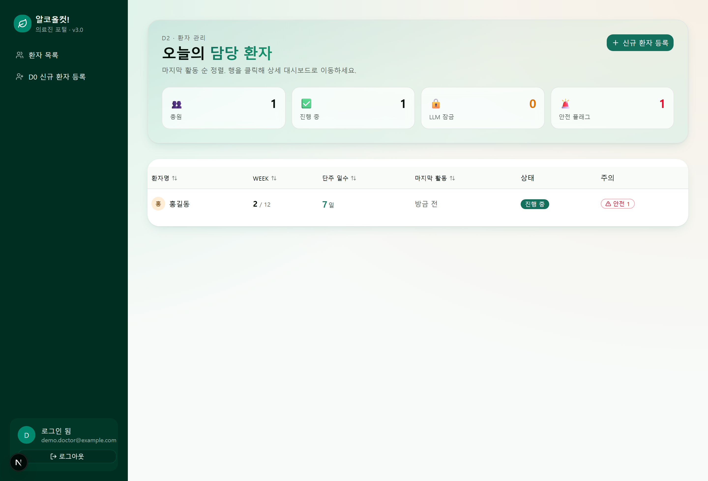
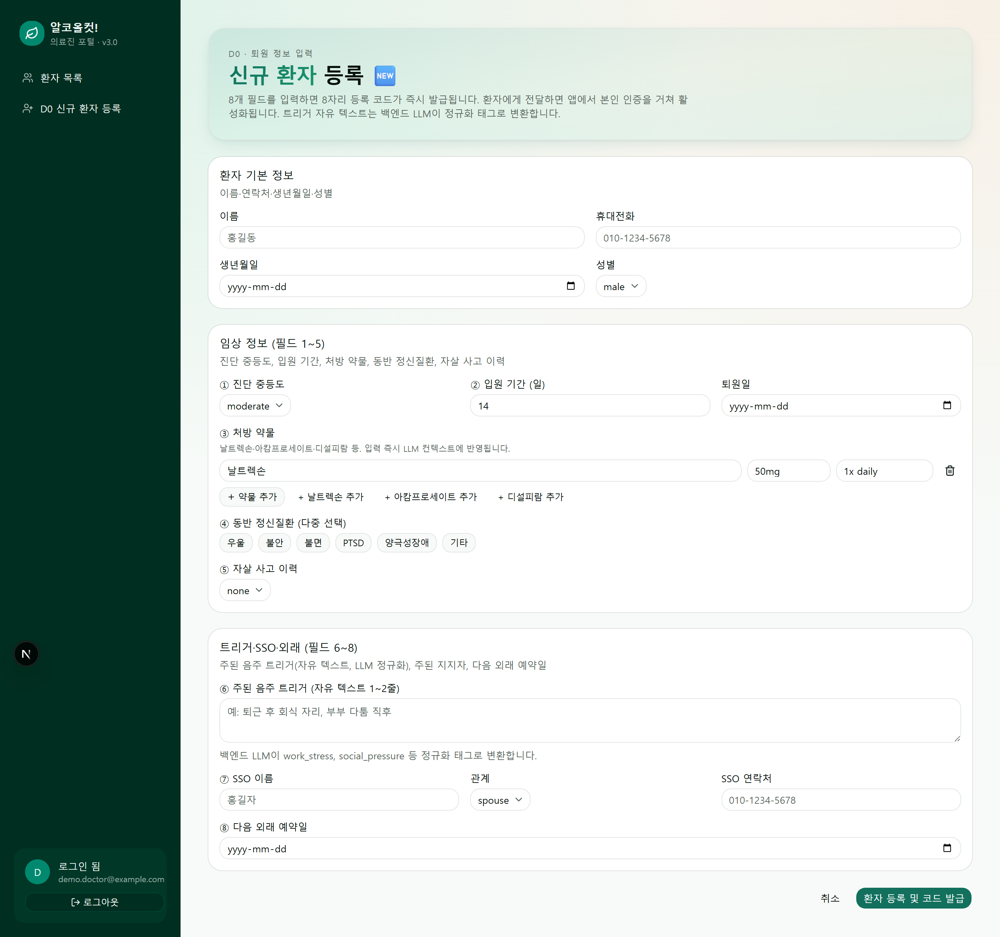

# Demo & Evidence — 데모 / 검증 증거

이 문서는 [README](../README.md)의 데모 섹션에서 분리한 **전체 스크린샷·LLM Trace 판정·재현 가능한 검증 로그**입니다.
아래 모든 화면·로그는 2026-06 기준 로컬에서 실제로 백엔드(Docker)·웹·앱을 띄우고 **실 Claude(Opus 4.8) 호출**로 캡처했으며, [README의 Quick Start](../README.md#quick-start--빠른-시작) 절차로 그대로 재현됩니다.

---

## 📱 환자 모바일 앱 (Expo · React Native)

| ① 가입 — 코드+PIN / 이메일 | ② 홈 — 단주·체크인·세션 | ③ AI CBT 세션 + LLM Trace |
|:---:|:---:|:---:|
|  |  |  |

* **홈**: 단주 일수, 오늘의 체크인(기분·갈망·수면·복약), 이번 주 핵심 세션, 갈망 대화·생각 노트 바로가기, 다음 외래 예약, 위기 시 어디서든 누르는 *도움이 필요해요* 버튼.
* **AI CBT 세션**: 코치(Claude Opus)가 **SSE로 토큰을 실시간 스트리밍**. 상단 `LLM TRACE` 패널은 이번 응답이 **어떤 가이드라인 블록과 시스템 프롬프트(3,310자)로 생성됐는지, 현재 단계, 감지된 갈망/안전 등급**까지 투명하게 보여줍니다(데모·임상 검증용).

---

## 🖥️ 의료진 웹 포털 (Next.js · shadcn/ui)

| 환자 목록 (D2) | 신규 환자 등록 (D0) |
|:---:|:---:|
|  |  |

**환자 상세 대시보드 (D2)** — 주차/단주일수/복약순응률, 30일 기분·갈망·수면 추이, **안전 이벤트 타임라인**, 퇴원 정보, 세션 이력, LLM 잠금/해제:


> 위 대시보드의 **"안전 이벤트 → 등급 B · 재발 신호(switch_resu)"** 는 데모용으로 환자가 *"어제 회식에서 결국 소주 두 병을 마셔버렸어요…"* 라고 보낸 메시지를 **안전 분류기가 실시간으로 등급 B(재발)로 분류**해 기록한 실제 이벤트입니다.

---

## 💬 실제 LLM 대화 — 한 턴 전체 (raw)

환자 메시지 → 백엔드 파이프라인(안전분류 → 컨텍스트 → Opus 4.8 코치 → 출력필터) 한 번의 실제 결과입니다.

**환자 입력**
> 요즘 회식 자리에서 술 권유를 받으면 거절하기가 너무 힘들어요. 이번 주에도 한 번 무너질 뻔했어요.

**코치 응답 (claude-opus-4-8, SSE 스트리밍)**
> 안녕하세요 길동님. 먼저 이렇게 솔직하게 이야기 꺼내주셔서 고맙습니다. 회식 자리에서 권유를 받는 게 정말 쉽지 않으셨겠어요. 그리고 "무너질 뻔했다"고 하신 건, 결국 그 상황을 넘기셨다는 뜻으로 들리는데요 — 그 자체가 쉽지 않은 일이었을 것 같아요. (…)
>
> 그래서 우선 지난 한 주를 좀 가볍게 점검해보고 싶은데요.
> - **기분**은 전반적으로 어떠셨어요?
> - **술 생각이나 갈망**은 얼마나 자주, 얼마나 세게 올라왔나요?
> - **잠**은 어떠셨어요?
> - 방금 말씀하신 회식 외에, 실제로 **술을 드신 적**이 있었는지도 편하게 말씀해 주세요.

**같은 턴의 내부 판정 (Trace)**

| 컴포넌트 | 모델 | 결과 |
|---|---|---|
| 안전 분류기 | Haiku 4.5 | `grade: none` (위험 없음, 신뢰도 0.95) — 오탐 없이 정상 진행 |
| 발화 분석 | Haiku 4.5 | 주 감정 *무력감*, 갈망 강도 **6/10**, 인지왜곡 *절제위반효과(AVE)* 감지 |
| 단계 추적 | Sonnet 4.6 | 세션 단계 **1/5 (체크인 리뷰)**, 진행률 0.2 |
| 출력 필터 | rule + Haiku | `passed: true` (의학 어휘·AVE 위반 없음) |

→ 코치가 5단계 CBT 세션의 **1단계(체크인 리뷰: 기분·갈망·수면·음주 점검)** 를 정확히 수행하고 있음을 내부 추적기가 독립적으로 확인.

---

## ✅ 재현 가능한 검증 로그

```text
$ docker compose up --build -d        # Postgres 16 + Redis 7 + FastAPI
$ docker compose logs api
  Running upgrade  -> 0001_initial ... -> 0009_drop_google_oauth   # 마이그레이션 9종 전부 통과
  app.startup LLM mode=real model=claude-opus-4-8
  Application startup complete.

$ docker compose exec api python -m scripts.seed_demo
  Provider ID  : pr_igcuy760wr
  Email        : demo.doctor@example.com
  Password     : DemoPassword!2026
  Patient ID   : p_1ne1dv1y83
  Reg code     : MBVVP56U   (POST /v1/auth/patient/register)

$ curl localhost:8000/v1/internal/health
  overall_status: healthy
  components: postgresql · anthropic_api · safety_classifier · stage_tracker
             · session_summarizer · output_filter · llm_gateway · context_builder  (8/8 healthy)
```

OpenAPI 정본 기준 **41개 경로 / 47개 오퍼레이션**, Swagger UI는 `http://localhost:8000/docs`.

---

## 🔬 안전 분류기 — 상세 검증

단발 문장이 아니라 **직전 2~3턴 맥락**을 함께 보는 **다중 턴** 분류기입니다. 같은 핵심 표현 *"죽고싶네"* 도, 맥락에 따라 **관용어(일반)** 와 **진짜 위기(등급 A)** 로 정반대로 구분합니다. 임상 원칙은 **재현율 > 정밀도**(놓친 위험 1건이 오탐 10건보다 위험).

* 테스트 자산: 다중 턴 시나리오 **8종 / 채점 턴 9개**, 단발 스모크 8종, 잠금 흐름 7종 — **각 턴 5회 반복, 5/5 전부 통과해야 PASS**(엄격 기준).
* **다중 턴 (실 백엔드 분류기): 9턴 중 8턴 통과 = 88.9%**, **등급 A(자살·급성중독) 오음성(false-negative) = 0%**. 동일 핵심 어구(*"죽고싶네"*) 대비쌍 — 관용어(MT-T01 → 일반)와 위기(MT-T02 → 등급 A) — 를 맥락으로 **양쪽 다 정확 판정**. 유일한 다중 턴 실패(MT-B01 T3)도 기대 등급이 *일반*인데 위험 등급을 발동한 **과탐**이라, 거짓 음성은 0건.
* **단발 스모크: 8건 중 6건 = 75%**, 두 오류는 모두 *함정 케이스에 대한 과탐(false-positive)* — 즉 재현율 우선 설계와 일치하며 **진짜 위험을 놓친 사례는 0건**.
* 분류 기준은 NIAAA CBI 매뉴얼(354p)에 **1:1 매핑된 518개 항목 카탈로그**에서 도출(출처 일치율 100%, 검수 완료).

검증 시나리오·실행 스크립트·결과 원본:

- 시나리오: `AUD_CBT_멀티턴_안전분류_테스트시나리오.xlsx`
- 백엔드 분류기 결과: `AUD_CBT_멀티턴_안전분류_테스트시나리오_backend_results.xlsx` · `..._backend_ST_results.xlsx`
- 실행 스크립트: `backend_classifier_test.py` · `backend_classifier_st_test.py` · `safty_test_runner.py`
